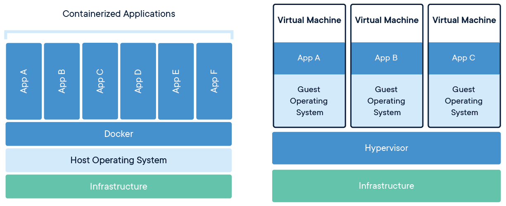
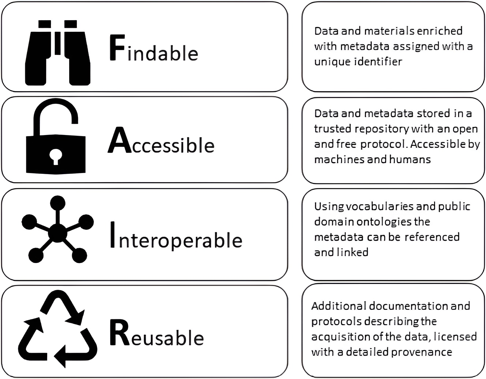

Mark Ziemann<sup>1*</sup>, Samuel S. Minot<sup>2</sup>, Pierre Poulain<sup>3</sup>, Anusuiya Bora<sup>1</sup>

1. Deakin University, School of Life and Environmental Sciences, Geelong, Australia.

2. Fred Hutchinson Cancer Center, Seattle, USA.

3. Université Paris Cité, CNRS, Institut Jacques Monod, Paris, France.

Correspondance: m.ziemann@deakin.edu.au

Source: https://github.com/markziemann/5pillars/blob/main/manuscript/5pillars.Rmd

## Summary

Computational reproducibility is a simple premise in theory, but in practice it is difficult to
achieve.
Building upon past efforts and proposals to maximise reproducibility and rigour in
bioinformatics, we present a framework called the five pillars of reproducible computational
research.
These include (1) code version control and sharing, (2) compute environment control,
(3) literate programming, (4) documentation and (5) FAIR data sharing.
These best practices will ensure that computational research work can be
reproduced quickly and easily, long into the future.
This guide is designed for bioinformatic data analysts, but should be relevant for other
domains.

## Introduction

In research, computational reproducibility is the ability to use the materials from a past study
(such as data, code and documentation) to regenerate the outputs including figures and tables to
confirm the study's findings @Goodman2016-wi.
Reproducibility is only the first step towards overall reliability, for example a study may be
reproducible, but suffer from analytical problems that invalidate the results.
If a study is reproducible, then at least these analytical issues can be more easily identified and
rectified.
Therefore, reproducibility is a necessary stepping-stone that should enhance the overall
reliability of computational research including replicability and robustness.
Replicability being defined as the ability to repeat the entire study and come up with similar overall
results.
Robustness refers to the ability for the findings to be generalisable to other situations
@Nosek2022-zc.

Unreliable research is a waste of resources and time and can mislead readers to pursue doomed
research directions.
Much has been written on how irreproducibility has reached crisis levels in psychology and life
sciences [@Baker2015-bs; @Begley2012-di].
Indeed, in bioinformatics, the situation is grim with a 2009 systematic evaluation showing only
2 of 18 articles could be reproduced (11%) @Ioannidis2009-hv, bringing into question the reliability of
those studies.
Workshops conducted by NIH intramural researchers in 2018/2019 sought to reproduce five bioinformatics
studies and could not reproduce *any*, citing missing data, software and documentation
@Zaringhalam2020-ms.
A recent systematic analysis of Jupyter notebooks in biomedical articles had similar observations, with
only 245/4169 notebooks (5.9%) giving similar results compared to the original, with irreproducibility
blamed on missing data, broken dependencies and buggy code @Samuel2022-ha.
A similar survey of R scripts in the Harvard Dataverse repository found slightly better results,
with 26% of scripts completing without errors [@Trisovic2022-dq].
Irreproducible bioinformatics has the potential to place patient safety at risk, as demonstrated by an
earlier case study @Baggerly2010-nr.
Researchers are theoretically able to achieve 100% computational reproducibility, yet as we see,
in practice this is rarely achieved.

A number of guides recommending enhanced computational reproducibility practices have been developed
[ @Tan2010-is; @Peng2011-ia; @Sandve2013-lk; @Piccolo2016-ji; @Lewis2016-qh;
@Wilson2017-uq ; @Akalin2018-eg ; @Gruning2018-sg; @Brito2020-ld; @Peikert2021-eq ; @Rodrigues2023-fw;
@DuPre2022-bk].
Inspired by these, this article attempts to unify the main principles into the
*five pillars of reproducible computational research* (**Figure 1**).
The intended audience is bioinformatics data analysts (not tool developers), however the
principles described here could equally apply to other domains of study.

```{r,5pillars,fig.cap="Figure 1. The five pillars of computational reproducibility.",echo=FALSE,fig.height=6}

library("RColorBrewer")
cols <- brewer.pal(5, "Set2")
cols2 <- adjustcolor( cols, alpha.f = 0.7)
plot(0,type='n',axes=FALSE,ann=FALSE, xlim=c(0, 10), ylim=c(0, 8.5))
polygon(c(0,1.8,1.8,0),c(1,1,6,6), col=cols2[1], border = NA)
polygon(c(2,3.8,3.8,2),c(1,1,6,6), col=cols2[2], border = NA)
polygon(c(4,5.8,5.8,4),c(1,1,6,6), col=cols2[3], border = NA)
polygon(c(6,7.8,7.8,6),c(1,1,6,6), col=cols2[4], border = NA)
polygon(c(8,9.8,9.8,8),c(1,1,6,6), col=cols2[5], border = NA)
polygon(c(-0.2,10,10,-0.2),c(-0.4,-0.4,0.8,0.8),col="lightgray", border = NA)
polygon(c(-0.2,5,10),c(6.3,8.5,6.3),col="lightgray", border = NA)
points( c(0.9,2.9,4.9,6.9,8.9) , c(4.5,2.5,4.5,2.5,4.5), pch=19,cex=18,col=cols )
text(5,7,lab="Five pillars of reproducible computational research", cex=1.5)
#mtext("Five pillars of reproducible computational research", cex=1.5)

labs <- c("Code version\ncontrol &\npersistent\n sharing",
  "Compute \nenvironment \ncontrol",
  "Literate\nprogramming",
  "Documentation",
  "FAIR &\npersistent\ndata sharing")

text( c(0.9,2.9,4.9,6.9,8.9) , c(4.5,2.5,4.5,2.5,4.5) , lab=labs)
text( 5 , 0.2 , lab="End-to-end code coverage")
#text(5,7,lab="Code testing")
text( 9, -0.2 , lab=expression(italic("created by Mark Ziemann")),cex=0.5)

```

## End-to-end code coverage

End-to-end code coverage is the foundation for reproducibility as the codebase should contain all
instructions for completing a data analysis task.
This removes the need for any manual steps, which are not only time-consuming but also prone to errors.
Without end-to-end code coverage, most of the other best practices described here are not possible.
Scripted workflows, although not always free of errors, enable better auditing and easier reproduction
which would be difficult for graphical tools like spreadsheets.
Indeed, spreadsheets are prone to data entry, manipulation and formula errors @Panko1996-ko, and are
somewhat overused in the life sciences.

Transferring data between compute platforms is also discouraged.
For example, having workflows that involve combinations of web-based and scripted tools require
data transfer steps which are inefficient and error-prone.
Related to this, the code and data need to be "linked", which means the code is aware of the location
of the data and how to get it.
The code should be able to fetch the data from a publicly accessible location and conduct the downstream
processing and analysis without having to acquire the data some other way.

A caveat for end-to-end code coverage is that sometimes manual data cleaning is unavoidable.
In those cases, retaining raw and cleaned data along with a cleaning protocol is recommended.
Then the computational workflow can begin with the cleaned dataset.

A guiding principle of the five pillars approach is that the publishing researchers should strive
to make the reproduction process easier and faster for those who wish to.
A "master script" that coordinates the execution of individual parts of an analysis is an excellent
way to reduce the number of commands required for reproduction.
This can be coded in standard languages like R/R Markdown, Python/Jupyter notebook or the Unix Shell.
Projects entailing big data analysis might benefit from a build/workflow automation solution like `make`,
`snakemake` [@Koster2012-sq; @Molder2021-mp], `drake` [@Michael_Landau2018-kk] or
`nextflow` [@Di_Tommaso2017-yo].
The advantage of such tools is that if the analysis were to terminate due to a hardware issue mid-way,
for example at step 8 of a 15-step workflow, the analysis of steps 1-7 wouldn't need to be repeated.
After fixing the hardware issue, re-running the analysis would pick up at step 8 again,
which saves labour and compute time.

## Literate programming

Literate programming combines "chunks" of analytical code with human readable text @Knuth1984-di.
After compilation, the resulting output document contains the code together with computational results
such as figures and tables along with contextualising explanations and narratives.

The Sweave project, conceived in 2001, was designed to give LaTeX documents embedded R code chunks and
was envisaged as a way to generate R documentation materials and generate statistical analysis reports
@Leisch2002-yc.
Around 2015, R Markdown emerged as a more popular alternative, as formatting content is simpler with
Markdown as compared to LaTeX, saving time.
An example R Markdown script and output report is given in **Figure 2**.


Around the same time, Project Jupyter was developed to provide a "notebook" type interface, incorporating
R, Python, Julia and other computer language chunks into documents @Perkel2018-rz.
The MyST{NB} (short for Markedly Structured Text notebook) is built on top of Jupyter and has some
notable advantages around flexibility of content that make it an attractive choice for an executable
paper authoring [@DuPre2022-bk].

In 2022, the company behind RStudio (Posit) released Quarto, the conceptual successor of R Markdown,
but with enhanced support for other computer languages like Python, Julia, and Observable JavaScript
@Bauer2023-eh.

Whether R Markdown, Jupyter or other system, literate programming offers some substantial benefits over
alternative approaches:

* The provenance of any result can be demonstrated.
The resulting document produced contains the code executed, together with the results (e.g.: a chart).
This is in contrast to a data analysis report assembled in a word processor, which due to the many
copy-paste operations required might contain errors, or version mismatches.

* It saves time.
For the case where a report needs to be run routinely, this would involve significant copy-paste to
be assembled "manually" with a word processor.
Using a literate script would mean only minimal changes are required between iterations @Perkel2022-af.

* It accommodates extensive documentation.
This allows the analyst to include rich descriptions of scientific works.
For example, a report may contain background, methods, results, discussion and references.
Not only text, but various objects can be included like links to other resources,
tables, images, videos, etc.
This means it is possible to author an entire journal article using literate programming.

* Outputs are arranged.
When using a regular script, an analyst might make dozens of charts which are written to the
disk with names like "chart1.png" or "model8.svg".
When the number of outputs is large, it becomes unwieldy and hard to place which plot corresponds
to which part of the script.
By embedding the outputs such as charts and tables in a document in the sequence that they were
generated, it helps the reader understand the logical steps taken in an analysis.

* Amenable to version control.
Version control is a useful best practice in software development (discussed below).

* Output reports are free from code errors.
The output document is only rendered when the entire script has been compiled without errors.
In contrast, a regular script might generate some outputs and then encounter an error,
so we are not sure whether the whole script is free of errors and completed successfully.
Therefore, it is good practice to routinely execute these scripts during the development process,
and not rely too heavily on the interactive execution of individual chunks or lines.

* Flexible output formats.
These include PDF, DOC/DOCX and HTML, the latter having some notable benefits
including better usability for mobile devices like phones and tablets, and the ability to
support richer content such as interactive charts and dynamic tables (searchable, filterable, sortable).
Outputs include HTML documents, but also slideshows and even ebooks.

These features make literate programming a quantum leap for science communication in a range of
situations.
Whether this is sharing a data analysis report, giving a presentation at a meeting,
writing a research article or self-publishing an ebook, literate programming provides the
ability to construct transparent data narratives with clear provenance in a conveniently shareable
form.

Literate programming also works neatly with the concept of the "executable paper", the idea that
the data analysis underlying an entire study can be reproduced with one or a few commands
[@Strijkers2011-py ; @Editorial2017-yt; @Lasser2020-mm].
A typical genomics/bioinformatics study could involve one large literate script, or be broken down into
smaller scripts, where each one contains the code for generating a part of the article.
A multi-script approach would benefit from a master script that executes each component.
This further makes the job of reproducibility easier.

## Code version control and persistent sharing

A version control system (sometimes called "source control") is a type of program that "tracks changes"
made to sets of files, typically other computer program source code, scripts and documentation.
A set of files under version control is called a "repository" and represents a project or sub-project.
Version control is used extensively by software developers and is considered one of the key best
practices in software engineering.
Distributed version control systems (DVCS) involve a central web-accessible server hosting a
repository, and each team member possesses a mirror copy on their local system (**Figure 3**).
Having a central, publicly available node assists in disseminating changes within teams and releasing
code to consumers.
There are many such DVCSs, but `git` has emerged as the most popular
solution due to its many powerful features, speed/efficiency and large community and ecosystem.

```{r,dvcs,fig.cap="Figure 3. Distributed version control. Adapted from @Chacon2014-ys.",echo=FALSE,fig.height=6}

cols2 <- adjustcolor( cols, alpha.f = 0.4)

plot(0,type='n',axes=FALSE,ann=FALSE, xlim=c(0, 10), ylim=c(0, 8.5))
polygon(c(-0.6,3,3,-0.6),c(0.8,0.8,5.2,5.2), col=cols2[1], border = NA)
polygon(c(-0.2,2.8,2.8,-0.2),c(1,1,2,2), col=cols[1], border = NA)
polygon(c(-0.2,2.8,2.8,-0.2),c(4,4,5,5), col=cols[1], border = NA)

polygon(c(3.1,6.7,6.7,3.1),c(0.8,0.8,5.2,5.2), col=cols2[2], border = NA)
polygon(c(3.3,6.5,6.5,3.3),c(1,1,2,2), col=cols[2], border = NA)
polygon(c(3.3,6.5,6.5,3.3),c(4,4,5,5), col=cols[2], border = NA)

polygon(c(6.8,10.2,10.2,6.8),c(0.8,0.8,5.2,5.2), col=cols2[3], border = NA)
polygon(c(7,10,10,7),c(1,1,2,2), col=cols[3], border = NA)
polygon(c(7,10,10,7),c(4,4,5,5), col=cols[3], border = NA)

polygon(c(2.5,7.3,7.3,2.5),c(7,7,8.5,8.5), col=cols[4], border = NA)

labs <- c("Developer 1",
  "Local Repo",
  "Working Files",
  "Developer 2",
  "Local Repo",
  "Working Files",
  "Developer 3",
  "Local Repository",
  "Working Files")

text( c(1.2,1.2,1.2,4.9,4.9,4.9,8.5,8.5,8.5), c(0,1.5,4.5,0,1.5,4.5,0,1.5,4.5), labels=labs )
text(4.9,7.7,labels="Main Repository",cex=1.5)

arrows( 1, 2, 1, 4 ,lwd=3)
arrows( 1.4, 4, 1.4, 2 ,lwd=3)
arrows( 4.7, 2, 4.7, 4 ,lwd=3)
arrows( 5.1, 4, 5.1, 2 ,lwd=3)
arrows( 8.3, 2, 8.3, 4 ,lwd=3)
arrows( 8.7, 4, 8.7, 2 ,lwd=3)
arrows( 1, 5, 2.5, 7 ,lwd=3)
arrows( 2.9, 7 , 1.4, 5 ,lwd=3)
arrows( 4.7, 5, 4.7, 7 ,lwd=3)
arrows( 5.1, 7 , 5.1, 5 ,lwd=3)
arrows( 7.3, 7, 8.7, 5 ,lwd=3)
arrows( 8.3, 5, 6.9, 7 ,lwd=3)

text(c(0.7,4.4,8) ,c(3,3,3), labels="commit",srt=90)
text(c(1.7,5.4,9) ,c(3,3,3), labels="update",srt=-90)
text(c(1.5) ,c(6.2), labels="push",srt=50)
text(c(2.4) ,c(5.9), labels="pull",srt=50)
text(c(4.4) ,c(6), labels="push",srt=90)
text(c(5.4) ,c(6), labels="pull",srt=-90)
text(c(7.3) ,c(5.9), labels="push",srt=-60)
text(c(8.2) ,c(6.2), labels="pull",srt=-60)

```

Computational researchers can benefit significantly by adopting DVCS into their routine
practices.
Below I outline some of the benefits.

* Keeps a complete history of all code changes over time.
We always know which version of the script is the most up to date.
We can inspect and execute the code and reproduce the analysis at any particular point in the past.
Commit messages are retained, which gives a record of the motivations, purpose and person behind each
modification.

* Helps collaboration and project management.
Using a centralised code hosting platform such as "GitHub" or "BitBucket" can help manage contributions
from team members who may be working asynchronously in different time zones and on different servers.
It also makes the user's work searchable, which is convenient when code snippets from a project
need to be reused for a new project.

* Helps resolve issues.
These centralised platforms also enable discussions of code issues such as bugs and feature requests.
In bioinformatics teams, issues can be used to track the progress of a project through its milestones
and allow team members to raise potential issues with the code.
This also allows the scientific community to raise an issue with the software maintainers.
For example, this feature is used extensively during the peer review process for the *Journal of
Open-Source Software* @Editorial2018-kt.

* Supports documentation best practices.
Books, educational resources and other data types are well served using DVCS (see below).

* Makes works easily shareable.
Work is easier to reproduce because the source folder contains a complete workflow with code linked
to data and metadata, so it doesn't need any modifications before reproduction.
It is relatively easy to add a software license with a DVCS like `GitHub`, so consumers can understand
the conditions of using it.

* Protect against code loss.
Computers sometimes fail and we sometimes delete or overwrite important files.
If code is lost and unrecoverable it can be a significant cost to replace.
Although DVCSs are not a back-up solution, they do add a layer of protection to the
code.
Preserving a copy of the repository on each team members' computer in addition to the central
repository means the code can be easily recovered if any one of those computers fails.

Although DVCSs assist with code sharing, they are not considered a long-term archiving solution and
might not survive the "ten-year challenge" of code reproducibility @Perkel2020-io.
To achieve that, the code needs to be deposited to a long-term repository.

[Zenodo](https://zenodo.org/) and [Software Heritage](https://www.softwareheritage.org/) repositories
are both good options for long-term archiving of software, and the
link to these should be provided in the respective journal article/pre-print.

`git` is typically used at the command line, however it is also integrated into Rstudio, JupyterLab and
VS Code, and there are also several `git` clients with graphical interfaces which better allow inspection
of code changes.

## Compute environment control

Most popular software undergoes regular updates to patch bugs and add new features.
Bioinformatics software is no different, and it is well known that such changes have the
potential to affect results @Seyednasrollah2015-cc.
This is why it is best practice to report the exact version of all programs used in an analysis
(and packages therein) and even make archival copies for future reference @Sandve2013-lk.

In R, such reporting is possible using the `sessionInfo()` command,
while for Python this is possible using the `session_info` package.
Using literate programming and sharing output documents ensures that a record of this important
information is made available.

Although regular software updates are overall a good thing, it poses a problem for future
reproducibility.
A researcher trying to reproduce a ten-year-old study in R v3.0 could have a headache, as they would need
to roll back their R version, and possibly their operating system as well, as R and other languages
require certain system dependencies for low-level routines @Vallet2022-no.

To avoid this, a virtual machine (VM) could be used to run a system-in-a-system.
This means that the "host" machine can run another "guest" operating system with the right R version,
without needing to change the host R version.
While this provides good reproducibility, setting up an environment with a ten-year-old operating system,
R and packages would take a few hours to accomplish.
Researchers could take a snapshot of their VM system and share it to help reproducibility and
auditability @Pasquier2018-nj, however the size of these images is relatively large due to the fact
it contains the OS, software stack and project data.
Moreover, the performance of computation in the guest system is typically slower than when run directly
on the host.

Containers are an attempt to resolve some of the downsides of VMs and package managers.
Container images can be thought of as similar to VMs, but are more lightweight as they
share parts of the host operating system [@Nust2020-cr].
In the example shown in **Figure 4**, the six containerised applications share the same operating
system, while the three VM applications each involve their own operating system which incurs a
significant performance overhead @noauthor_2021-lt.
Therefore, running workflows in containers incurs only a small reduction in performance as compared
to running directly on the host system @Di_Tommaso2015-pw.
Container images are highly portable because containers include everything needed to run the
application, including the system tools and libraries, ensuring that the environment is consistent
across different systems.
For example, the most popular containerisation system, Docker [@Merkel2014-ek], makes it
possible to run Windows and Linux/Unix containers on any computer with Docker installed, with the
promise of reproducibility.
While there are several alternatives such as Podman and Rkt, Docker remains the most widely used
containerisation system for web development and research.
Due to its early adoption, Docker now has a large community of users, extensive documentation and
a vast collection of pre-built container images in the DockerHub registry.
Docker can fetch images from DockerHub and run them on the host system with just a couple of commands,
and typically within a few minutes.
This accelerates the installation procedure dramatically which is a known bottleneck for bioinformatic
reproducibility [@Mangul2019-ei;@Mangul2019-xp].



Another potential solution to this problem is to use a package/environment management system such as
[Conda](https://conda.org/) or [Guix](https://guix.gnu.org/).
These allow users to create, manage, and deploy software packages,
dependencies, and environments across different computing platforms @Perkel2023-cv.
Conda was initially developed to solve the problem of package dependency management in Python,
but it now supports many other programming languages, including R, C/C++, Java, and others.
Conda allows researchers to create isolated environments with specific versions of
packages, so users can have different versions of R or Python in different environments
on the same host system.
Conda environments have limitations around portability and consistency, as such environments
are tied to specific operating systems and hardware architecture.

Guix is described as a "functional package manager" and has the unique benefit of giving
system-level build reproducibility [@Vallet2022-no].
This is a notable advantage, as Docker images are not guaranteed to build reproducibly in the future
due to link decay.
Moreover, Guix can build and output environments as Docker-compatible images which solves the
provenance problem of such environments [@GNU_Project_Volunteers2022-bt].
These features are being used in the bioinformatics sphere to create highly reproducible pipelines
that work equally well on personal as well as shared computer systems @Wurmus2018-lv.
Although Guix has some exciting functionality, there remains a relative lack of step-by-step guides and
tutorials, illustrated by the complete absence of published Guix protocols in protocols.io, as compared
to 13 and 12 related to "Conda" and "Docker" respectively (as at 30th May 2023).

We are also watching with interest the early development of WebAssembly (Wasm) based approaches for
compute environment control.
The ability to reproduce operating systems, programming languages and workflows in the browser
opens up intriguing possibilities for more widespread reproduction and auditing without the need to
install any software at all.
Two notable examples of this include JupyterLite, a version of JupyterLab in early development that
runs entirely in the browser @Tuloup2021-le, and WebR-enabled interactive code blocks in Quarto HTML
documents @Balamuta2023-ma.

It is not sufficient to simply use these tools, they need to be shared as part of the publication
process.
Conda environments are described by a file called `environment.yml` which acts like a recipe for how to
make the environment.
Similarly, Guix environments rely on two files: `channels.scm` and `manifest.scm`.
Docker images are built using a `Dockerfile` instruction set.
These are small files which are easily shared in the project code repository.
To enable rapid reproduction, making Docker images available is recommended.
As these are often very large they cannot be shared in the code repository; rather
they are commonly deposited to a Docker image registry such as DockerHub.
One must keep in mind that availability of images is dependent on the
commercial viability of Docker Inc, so it isn't guaranteed to survive the 10-year challenge.
To ensure long-term availability, it would be advised to deposit images to the BioContainers registry
@Da_Veiga_Leprevost2017-yw, as it is community driven and supported by consortia such as *Elixir* and
*Global Alliance for Genomics and Health* that will underpin its longevity.
Still, these are not considered permanent archival services, so it is advised to deposit the image
used in an article to a suitable persistent long-term archive (discussed below).

## FAIR and persistent data sharing

Without data sharing, computational research is not reproducible nor auditable.
Lack of data sharing is one of the key reasons why research is irreproducible
[@Ioannidis2009-hv, @Archmiller2020-er ].
Data sharing is also one of the key features of "open science", which is characterised as science
that is collaborative, transparent, accessible and inclusive [@noauthor_2023-uq].
In addition to facilitating reproduction and auditing, sharing enables reuse in other contexts.
Data reuse increases efficiency, as it prevents redundant research expenditure and facilitates new
research ideas that were previously impossible [@Wilkinson2016-qq].
In terms of research rigour, inspecting raw data can uncover inadvertent errors and research
integrity problems [@Miyakawa2020-yj].
In light of this, a research article without supporting data and code is much like a press release or
advertisement where the claims made cannot be verified as true or not [@Donoho2010-yz, @DuPre2022-bk].

Although it is common to see journal articles with "Data available upon reasonable request", this is less
than ideal.
A systematic study of such data availability statements found that the data was successfully provided
in just 6.8% of requests [@Gabelica2022-ci].
In the rare cases that data is shared in accordance with the data availability statement, it poses
a burden in terms of labour to lodge and respond to such requests, and if the data is large, may incur
an additional cost for hosting/transferring these large files.

The field of genomics has a long history of data sharing @Brazma2001-yk, which is supported by
policy leadership by funding bodies
[@National_Health_and_Medical_Research_Council2019-yx;
@Office_of_The_Director_National_Institutes_of_Health2023-ss] and data sharing policies of journals
(eg [@Packer2018-ru; @Hanson2011-ub ; @Cheifet2020-wu]), although there are some challenges.

Some researchers would rather keep data for their private use.
Some may keep data private due to concerns over participant privacy.
This is a well-founded concern for identifiable data, however once identifying features are removed,
it is nearly impossible to reidentify genomic data @Venkatesaramani2021-tn unless the attackers have
preexisting genomic data describing an individual or ancestry [@Schadt2012-md; @Gymrek2013-fz].
Therefore, sharing deidentified genomic data and metadata is likely to carry little risk to participant
privacy.
Still, much human genomic data and metadata resides in restricted databases due to the scope of
data sharing that was agreed to in the consent process.
For example, the consent form may only allow sharing of data to researchers investigating certain
diseases, which means a vetting process must be undertaken before sharing data with external
investigators.
In the interests of reuse and reproducibility, future studies could consider a consent form that allows
more broad sharing of deidentified data.

In order to maximise the value of shared data for reuse and reproducibility, it needs to be Findable,
Accessible, Interoperable and Reusable (FAIR) for people and for computers @Wilkinson2016-qq.
These principles are summarised in **Figure 5**.



High throughput biology has already built a number of data repositories for specific data types
conforming to FAIR principles (e.g.: GEO, SRA, PRIDE [@Edgar2002-hs; @Kodama2012-bn; @Deutsch2017-hc]).
However other domains lack well known specialised organised data repositories, such as evolutionary
biology, ecology, cell biology, social sciences and computing.
The [re3data.org](https://www.re3data.org/) registry of data repositories may be useful to find a
repository that accepts data from these fields [@Pampel2013-ep].
If no specialised repository exists, then a general-purpose repository such as
[Dryad](https://datadryad.org/), [FigShare](https://figshare.com/), or [Zenodo](https://zenodo.org/)
should be considered.
Moreover, general recommendations have been proposed to enhance data FAIRness in ecology, but which
can also be applied to other disciplines [@Roche2015-aq].

Key recommendations include:

1. Depositing data to a specialised repository if possible, otherwise, a general-purpose repository.

2. Avoid commodity cloud storage as these are impermanent and susceptible to link decay @Hennessey2013-tj.

3. Avoid large supplementary data files accompanying journal articles as these are less findable and
accessible.

4. Preferably archive and share raw data and use existing standards for the discipline.

5. Use file formats that are compatible with many different types of software; e.g.: comma-separated
values (CSV) files are preferred over Excel files.

6. Provide detailed metadata; e.g.: sample descriptions that match the manuscript; describe the columns
in tabular data.

Once the quality of the data set has been established researchers may consider depositing it
to a data repository early, before publicisation, as it has some advantages.
Most data repositories have an optional 12-month embargo period so researchers can share publicly
at a later date once they're happy with the overall project.
The data repository acts as an additional backup to the host institutions' own in case of data loss
or calamity.
By assuming the data and metadata can be sourced from a public location, the workflow developers ensure
that the code they share won't suffer from "file not found errors" during reproduction.
This ensures code and data are linked, which has been a priority for reproducibility [@Peng2011-ia],
and a source of problems for shared code [@Samuel2022-ha].

In addition to the experimental data, reference data that is critical to a project should be archived.
For example, in the field of genomics, gene function annotation sets are relied upon for a common
procedure called "pathway analysis" @Khatri2012-ye.
These annotation sets are regularly updated, but versions are rarely reported [@Wijesooriya2022-ly]
and finding historical data versions is sometimes difficult.
In order to guarantee future reproducibility, snapshots of those reference data should be archived
and shared if the licence permits it.

## Documentation

Documentation is the glue that binds a data science project together.
The manuscript/published article is the central artefact that outlines the research project and
links to the supporting materials.
From a reproducibility standpoint, the methods section is the most critical part.
It should be detailed enough so that other researchers can understand and replicate the
experiments/analysis and yield similar results.
The "Materials Design Analysis Reporting" (MDAR) checklist for authors has been developed to assist in
comprehensive methodological reporting in the life sciences [@Mellor2022-up].

Researchers should consider depositing their thorough laboratory/*in silico* protocols as separate
outputs to relevant repositories such as [protocols.io](https://www.protocols.io/),
[RIO Journal](https://riojournal.com/) or [Zenodo](https://zenodo.org/), minting a Digital Object
Identifier (DOI) that can be cited in the manuscript.
This is particularly helpful when there are strict word limits on articles.

The manuscript should have clear links to supporting materials including datasets, software code and
other resources like computational environments.
The code repository should have a detailed `README` file which plays a critical role in reproducibility.
It should outline the purpose of the code/software/overall project and how it relates to the
manuscript/article.
For example, some articles may rely on more than one repository for various parts of the research
project, so these need to be explained.

The `README` should outline exactly what is required in order to reproduce the
analysis, including the requirements and the instructions to reproduce.
Typically it is written in the Markdown format, which should be familiar to those using R Markdown or
Jupyter notebooks.
Hardware requirements such as RAM, CPU architecture, GPU needs, etc need to be outlined.
Software requirements, such as operating system, container engine, workflow manager,
etc, also need to be described.
The exact instructions for reproduction should be clearly outlined.
This should include what the output objects of the analysis are, and instructions on how to access the
results and what should be expected.
Literate programming allows for thorough documentation of workflow methods and results which makes
it more accessible for reproducers to comprehend the workflow details, which is not possible with
standard code comments [@Rule2019-eh].
These instructions should be tested whenever changes are made to the codebase.

As outlined above, one of the goals is to reduce the complexity of reproduction, and using a master
script is a simple way to do this.
It also makes the `README` documentation much simpler.
For example, the pathway analysis workflow we previously developed could be reproduced and inspected
with just six commands, starting from a new Ubuntu Linux install [@Ziemann2023-nm].
By minimising the complexity of reproduction and writing the instructions clearly in the `README`,
reproducibility is made possible to a larger segment of the computational research community,
especially those who are not experts in the languages used.

In addition, the `README` should outline the contents of the repository, how users can contribute to
the codebase and how to report issues, such as code errors and discrepancies.
The `README` should also list the contributors to the codebase and acknowledge any financial support.
It may also include a link to the research article, citation instructions and a mention of the software
license.

The need for documentation extends to the other supporting information.
The deposited data set needs thorough descriptive metadata to provide context.
The container image and code snapshot should be deposited to a persistent repository with
a thorough description of their purpose.
Both the data and container image descriptions need to contain links to the DOI of the manuscript,
so that machines or individuals browsing these resources can understand the context of these objects
relative to the overall research project.

## Limitations and challenges

Due to the constantly developing software landscape, this review is not intended to give strong
recommendations on the exact combination of tools or resources to use in computational research,
but to set out key principles and highlight some useful solutions that users can incorporate
into their toolkit to improve the overall reproducibility of their work.

When these principles are not integrated correctly and checked, problems readily emerge
[@Barba2016-kk; @Samuel2022-ha; @Zaringhalam2020-ms].
This is why regular code testing is another recommended best practice, especially after making updates
to the code or data [@Rule2019-eh; @The_Turing_Way_Community2019-ig].
It is worthwhile to conduct such testing on a separate computer to understand how someone else in the
scientific community would fare reproducing such a workflow.

Moreover, some have suggested adapting software development
principles of unit tests and continuous integration/continuous delivery.
This approach, called "continuous analysis" involves automatic execution and testing whenever a change is
made to a project's code base [@Beaulieu-Jones2017-vj; @Blischak2019-dq].
If the workflow executes successfully and tests are passed, the repository can be decorated with a
"badge" to inform users of the lack of errors in the code.
If those tests are designed cleverly such that certain conclusions drawn in the corresponding research
article can be assessed computationally, then such tests could be used to demonstrate computational
reproducibility without the need for individuals to execute the workflow themselves.
Continuous analysis might therefore be a future pediment (crowning feature) to the five-pillared
"temple" of reproducible research.

The key technological advances enabling the five pillars approach have been around for about a decade,
yet progress on integrating these into computational research publications has been minimal.
Part of the problem is the incentive structures in academia, with funding bodies and journals more
focused on novel research directions rather than confirming previous findings
[@Kaelin2017-id; @Munafo2017-ty; @Diong2021-is].
Indeed the number of systematic replication studies in bioinformatics remains small
[@Zaringhalam2020-ms ; @Ioannidis2009-hv; @Samuel2022-ha], so we don't have much of a grasp as to how
severe the problem actually is.

A lack of technical computer skills in many research groups is another culprit.
Specific workshop-based training in these areas could help, but the most scalable solution would be to
provide comprehensive beginner-friendly step-by-step guides for frequently used routines.
For example, our group has just released such a protocol that walks novice users through the process
of implementing functional enrichment analysis of gene expression data with the five pillars principles
@Ziemann2023-nm.
More such protocols are needed to make extreme reproducibility mainstream.

## Conclusion

Reproducibility is an essential feature of reliable computational research yet current practices
are falling short of this goal.
Our recommendations for workflow-based research articles are summarised as:

0. Encapsulate the entire workflow with end-to-end code, executable with a master script.

1. Share the code repository and deposit a snapshot to an archive.

2. Share a controlled environment; options include a Docker or virtual machine image or
configuration for Conda or Guix.

3. Use literate scripting tools like R Markdown or Jupyter notebooks to generate all outputs,
such as charts and tables.

4. Document the workflow sufficiently for reproduction, especially the repository `README`.

5. Share research data and metadata according to FAIR principles.

## Acknowledgements

We are grateful to individuals who provided feedback on an earlier draft of the concept including
Dr Aziz Khan (Stanford University),
Dr Sriganesh Srihari (QIMR Berghofer Medical Research Institute),
Dr Barbara Zdrazil (EMBL-EBI) and
Dr Irene López Santiago (EMBL-EBI).

This research was supported by use of the Nectar Research Cloud, a collaborative Australian research
platform supported by the NCRIS-funded Australian Research Data Commons (ARDC).

## Availability of materials

Code repository: https://github.com/markziemann/5pillars

## Bibliography
